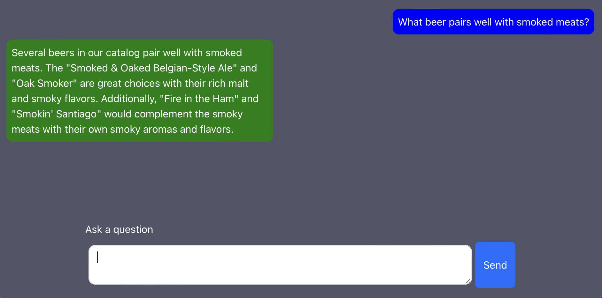

= Spring AI Redis Demo
:linkattrs:
:project-owner:   redis-developer
:project-name:    spring-ai-redis-demo
:project-group:   com.redis
:project-version: 0.0.1-SNAPSHOT
:project-title:   Spring AI Redis Demo

---

A Retrieval Augmented Generation demo using link:https://docs.spring.io/spring-ai/reference/[Spring AI] and link:https://redis.io/docs/interact/search-and-query/advanced-concepts/vectors/[Redis Vector Search].

== Pre-requisites

=== Docker

This demo requires Docker to build and run the application.

=== Azure OpenAI

Obtain your Azure OpenAI `endpoint` (e.g. `https://demo-us-west.openai.azure.com/`) and `api-key` from the Azure OpenAI Service section on https://portal.azure.com[Azure Portal].

The Spring AI project defines a configuration property named `spring.ai.azure.openai.api-key` that you should set to the value of the `API Key` obtained from Azure.

If your model deployment name is not the default `gpt-35-turbo` you can specify it using the configuration property named `spring.ai.azure.openai.chat.options.model`.

Exporting an environment variable is one way to set these configuration properties.
[source,console]
----
export SPRING_AI_AZURE_OPENAI_API_KEY=<INSERT KEY HERE>
export SPRING_AI_AZURE_OPENAI_ENDPOINT=<INSERT ENDPOINT URL HERE>
export SPRING_AI_AZURE_OPENAI_CHAT_OPTIONS_MODEL=<INSERT MODEL NAME HERE>
----

== Run the demo

[source,console]
----
git clone https://github.com/{project-owner}/{project-name}.git
cd {project-name}
docker compose up
----

Once the Spring application is running (`com.....Application: Started Application in ...`), point your browser to link:http://localhost:8080[localhost:8080] and ask a question around beers:

